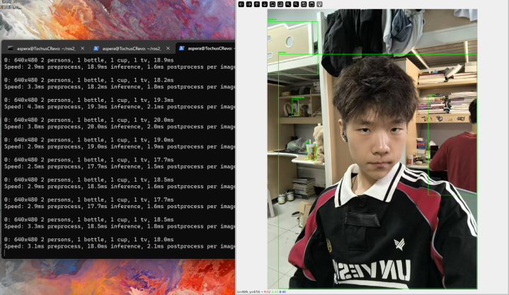

<div align="center">


<h1 style="margin-top: 0"> 基于ROS2通信的目标检测 </h1>

### 初识智能计算系统


[](https://index.ros.org/doc/ros2/)
[](https://www.python.org/)


[](https://github.com/TochusC)


[**简体中文**](/README.md) | [**English**](/docs/en/README.md)

</div>

---

## 项目结构📁
```angular2html
docs  # README相关文件
├── img
resources # 资源文件
ros_yolo # 实现代码
├── src
│   ├── init.py # 初始化节点
│   ├── camera_capture_function.py # 摄像头捕获功能
│   ├── target_detect_function.py # 目标检测功能
test # 测试文件
package.xml # ROS2包描述文件
setup.cfg # 配置文件
setup.py # 安装文件
```

## 实现细节🔍
使用ROS2进行通信，发送结点摄像头捕获图像，接收结点接收图像数据，并使用YOLOv8进行目标检测，
并将检测结果绘制显示。

## 如何运行❓
1. 将项目克隆至ROS2工作空间，如  `~/ros2_ws/src/`
2. 进入工作空间，构建项目，执行  `colcon build`
3. 设置运行环境，执行  `source ~/ros2_ws/install/setup.bash`
4. 启动发送节点，执行  `ros2 run ros_yolo capturer`
5. 启动接收节点，执行  `ros2 run ros_yolo detector`
6. 玩好😉！

## 运行效果🌟
<div align="center">



</div>
